# Presentation Notes — Gene Expression Pattern Matching

A single-page-style study guide for presenting this work. Pulls from
`MATH_FOUNDATIONS.md`, `SUMMARY_REPORT.md`, and the notebooks.

---

## 1. The Problem in One Sentence

For ~17,856 TCR genes measured across 4 timepoints (t = 0, 3, 6, 9) under 4
different cluster conditions, find the genes whose temporal expression most
closely matches each cluster's biologically observed "constraint pattern", and
check whether different similarity metrics agree on which genes those are.

### Why it matters
Ethan Kyi's prior work used NMF to find pattern-matching genes. Nancy Guo flagged
that NMF (because all factors are non-negative) loses the *direction* of regulation
and effectively ranks by coefficient magnitude, not by shape match. We're testing
whether shape-aware similarity metrics give more biologically meaningful results.

---

## 2. The Data

- **~17,856 genes total** — the *same* gene list appears in every cluster file
  (clusterOne, clusterTwo, clusterThree, clusterFour). A "cluster" is not a
  partition of genes; it's a different experimental condition/sample group.
  Each gene therefore has 4 expression vectors (one per cluster) and is scored
  against all 4 constraint patterns.
- **4 timepoints**: 0, 3, 6, 9 (hours)
- **Two versions**: raw counts and log-transformed (LT)
- **One constraint pattern per cluster** — the biological reference signal.
  Each cluster has both a **raw** and a **log-transformed (LT)** version:

**Raw constraint patterns:**

| Cluster | t=0 | t=3 | t=6 | t=9 | Shape |
|---|---|---|---|---|---|
| clusterOne | 1.45 | 12.0 | 5.21 | 6.51 | Spike at t=3, partial recovery |
| clusterTwo | 0.371 | 0.803 | 1.22 | 1.78 | Steady monotonic increase |
| clusterThree | 0.0405 | 0.0 | 0.0369 | 0.0353 | Near-flat with dip at t=3 |
| clusterFour | 0.00913 | 0.638 | 0.0178 | 0.0243 | 70× spike at t=3 (delta) |

**Log-transformed (LT) constraint patterns:**

| Cluster | t=0 | t=3 | t=6 | t=9 | Notes |
|---|---|---|---|---|---|
| clusterOneLT | 0.8945 | 2.5687 | 1.8260 | 2.0165 | Spike compressed from 8× to ~3× |
| clusterTwoLT | 0.0364 | 0.5896 | 0.7983 | 1.0235 | Increase becomes more linear-looking |
| clusterThreeLT | 0.0397 | 0.0 | 0.0363 | 0.0347 | Barely changes — values were already small |
| clusterFourLT | 0.00909 | 0.4937 | 0.01760 | 0.02401 | Spike compressed from 70× to ~50× |

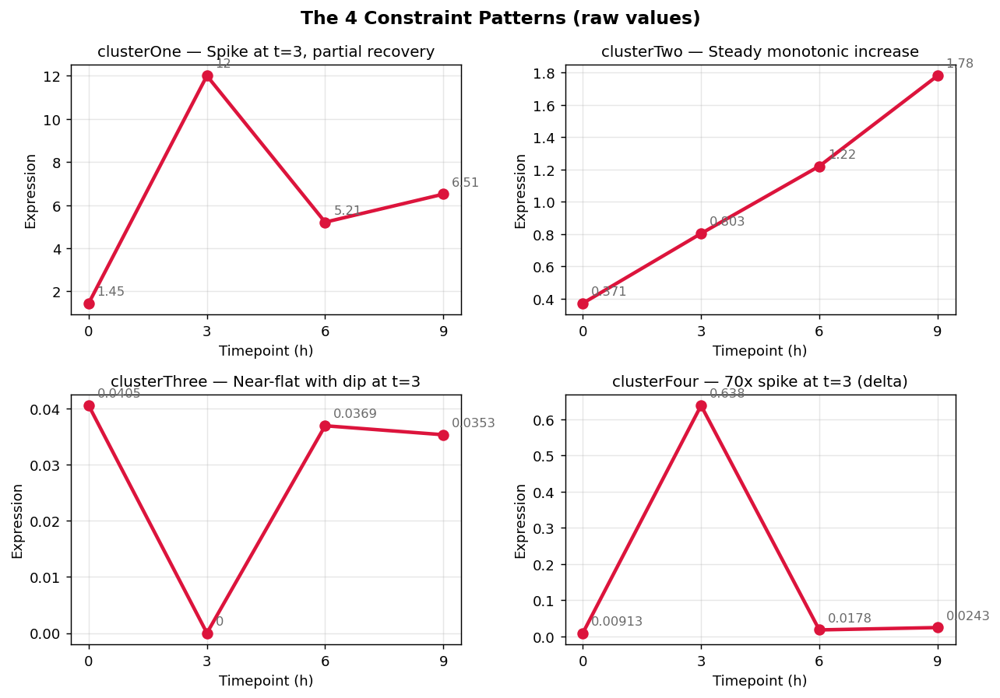

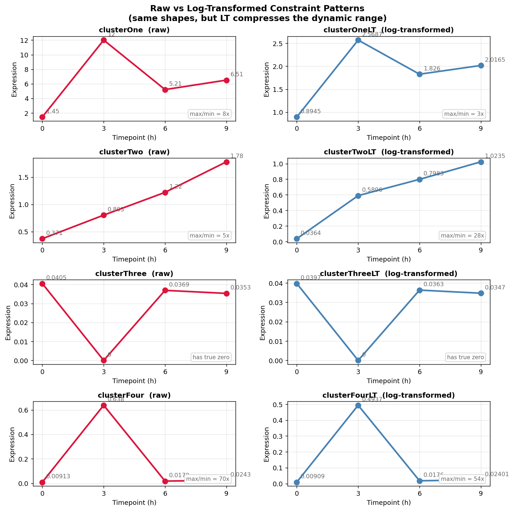

> **Same shapes, different magnitudes.** The log transform doesn't change
> which timepoint is the max or min — clusterOne still spikes at t=3,
> clusterThree still dips at t=3, etc. So the metrics tend to behave
> similarly on raw vs LT data, but the LT data is "easier" because the
> dynamic ranges are compressed and the gene curves are more visually
> comparable to the pattern. The clusterThree zero at t=3 stays a zero
> (since $\ln(1+0) = 0$), so sMAPE *still* fails on clusterThreeLT for
> the same reason it fails on clusterThree raw.

> Each cluster tests a different shape archetype, which is why no single
> method wins across all four. Note that clusterFour's t=3 value (0.638) is
> ~70× larger than its other timepoints — after normalization this becomes
> effectively a delta function $[0, 1, 0, 0]$, which is why it defeats every
> metric.

---

## 3. Normalization (Foundational — Asked About a Lot)

All metrics operate on vectors normalized into the range $(0, 1]$ via:

$$x_{\text{norm}} = \frac{x - \min(x) + \varepsilon}{\max(x) - \min(x) + \varepsilon}$$

- $\varepsilon$ (a small positive constant) does two jobs:
  1. Prevents division by zero for **constant genes** (where max = min). There
     are 1,007–6,933 such genes per cluster.
  2. Forces the lower bound to be just *above* 0 — the range is $(0, 1]$, not
     $[0, 1]$. (This matters for percentage metrics like sMAPE.)
- Constant genes end up as $[1, 1, 1, 1]$ — handled correctly by all metrics.
- Both the constraint pattern **and** every gene are normalized the same way,
  so all comparisons are scale-matched.

**Why normalize at all?** Without normalization, MSE/Frechet/DTW would be
dominated by absolute expression level — high-expression genes would have huge
distances from the pattern regardless of shape. Normalization removes magnitude
from the picture so the metrics can focus on shape.

---

## 4. The 6 Similarity Metrics

For each metric: formula, intuition, key property, where it shines/fails.

### 4.1 Pearson Correlation  *(higher is better, range [−1, 1])*

$$r = \frac{\sum_{i}(p_i - \bar{p})(g_i - \bar{g})}{\sqrt{\sum_{i}(p_i - \bar{p})^2} \cdot \sqrt{\sum_{i}(g_i - \bar{g})^2}}$$

- **Intuition**: cosine of the angle between the **mean-centered** vectors.
- **Key invariances**: scale-invariant *and* shift-invariant. Multiplying or
  adding a constant to a gene's expression does not change r.
- **Strength**: directly answers "does this gene rise/fall at the same timepoints
  as the pattern?" — exactly the biological question.
- **Limitation**: with n = 4 timepoints, t-test has only df = 2. Roughly **20%
  of random vector pairs have |r| > 0.8 by chance**. Individual r values are
  not interpretable in isolation; what matters is the *ranking order* across
  all ~17,856 genes.
- **Recommended primary metric.**

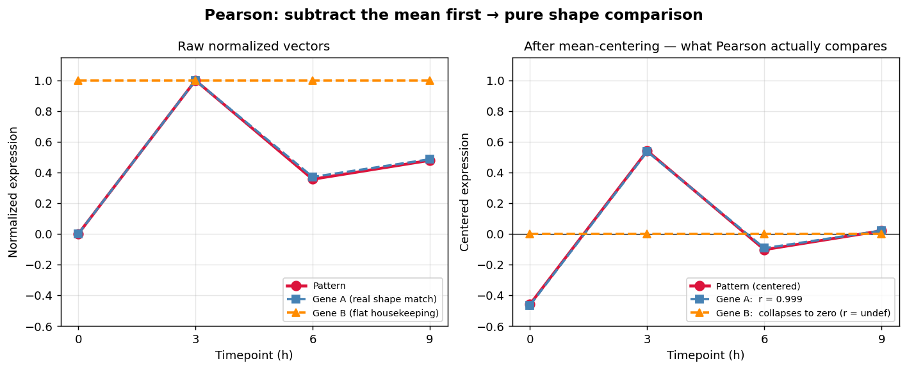

*Left: raw normalized vectors. Gene B (housekeeping) is flat at 1.0.
Right: after subtracting each vector's mean, Gene A overlays the pattern almost
exactly (r ≈ 0.999), and Gene B collapses to the zero line — Pearson sees no
shape there to compare.*

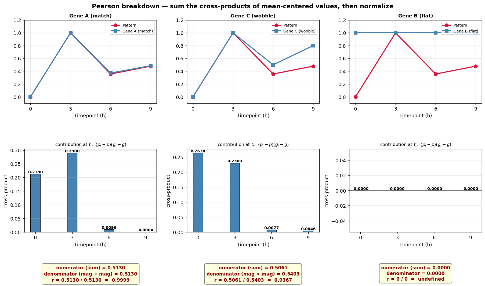

*Per-gene breakdown. The bar chart shows the **cross-product**
$(p_i - \bar p)(g_i - \bar g)$ at each timepoint — these are the inputs that
get summed into the numerator. The yellow box shows the sum, the denominator
(product of vector magnitudes), and their ratio = r. For Gene B, the centered
vector is all zeros, so every cross-product is 0, the denominator is 0, and
r is undefined.*

### 4.2 Cosine Similarity  *(higher is better, range [0, 1] for non-negative data)*

$$\cos(\theta) = \frac{\sum_{i} p_i g_i}{\sqrt{\sum_{i} p_i^2} \cdot \sqrt{\sum_{i} g_i^2}}$$

- **Intuition**: same dot-product-over-magnitudes as Pearson, but **without**
  mean-centering first. So Pearson = Cosine on mean-centered vectors.
- **Decomposition**: cosine = (Pearson term) + (baseline-bias term involving
  $\bar{p}\,\bar{g}$). When the means are large relative to the variation, the
  baseline term dominates.
- **Failure mode (memorize this)**: a flat housekeeping gene like $[10,10,10,10]$
  (which normalizes to $[1,1,1,1]$) gets cosine ≈ **0.79** against the
  clusterOne pattern, but Pearson r = **undefined** (no shape exists). Cosine
  consistently pulls in housekeeping genes (e.g. EEF1A1) that have no temporal
  dynamics.
- **When cosine is the right tool**: document similarity / TF-IDF, where a zero
  baseline is meaningful. *Not* shape matching.

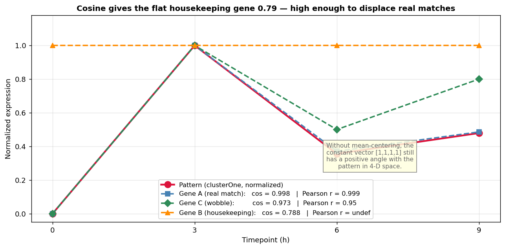

*All three genes overlaid against the clusterOne pattern. Gene B (the flat
housekeeping line at 1.0) gets cosine = 0.788 — high enough to outrank
thousands of genes that actually have temporal dynamics. Pearson correctly
returns "undefined" for it.*

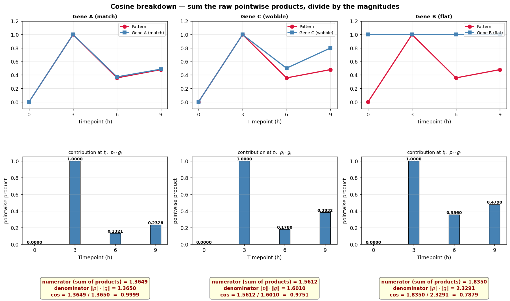

*Bars are the **raw pointwise products** $p_i \cdot g_i$ — the inputs to the
sum. Notice that for Gene B (flat housekeeping), the t=0 product alone is
already nonzero (1.0 × the pattern's t=0), and the t=6/t=9 products are 0.36
and 0.48 because Gene B contributes a "1" at every timepoint. Without
mean-centering, those baseline contributions add up and cosine returns 0.788.
Compare to the Pearson breakdown above — for Gene B Pearson centers the
vector to zero and the entire numerator vanishes.*

### 4.3 DTW — Dynamic Time Warping  *(lower is better)*

$$C[i,j] = d(p_i, g_j) + \min(C[i{-}1,j],\, C[i,j{-}1],\, C[i{-}1,j{-}1])$$

DTW distance = $C[n,n]$, the minimum-cost path through the cost matrix
($d$ is squared Euclidean point-distance).

- **Intuition**: stretch/compress the time axis of one series to best align
  with the other, only moving forward in time. Designed to catch genes that
  *would* match the pattern if they were shifted by a few timepoints.
- **Why it's mostly redundant here**: with n = 4, the cost matrix is 4×4 and
  warping can shift at most 1 position before becoming prohibitively expensive.
  The flexibility that makes DTW powerful on 15+ point series barely manifests
  with 4 points — it degenerates into a slightly-flexible MSE.
- **Where it does diverge**: clusterTwo (monotonic increase). Pearson–DTW
  overlap is only **3/20** there because warping lets DTW pick out genes with
  slightly delayed monotonic increases.
- **Asymmetric ascending convention**: lower DTW distance = better match.

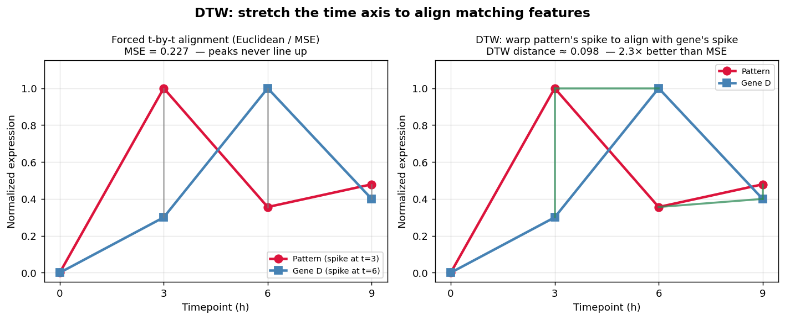

*Gene D peaks at t=6, the pattern peaks at t=3. Left: forced point-to-point
alignment (what MSE/Frechet/Pearson see) — every comparison is wrong.
Right: DTW's warping path bends pattern's t=3 spike across to gene's t=6
spike, dramatically reducing the distance. With only 4 points, this is the
maximum warp DTW can do.*

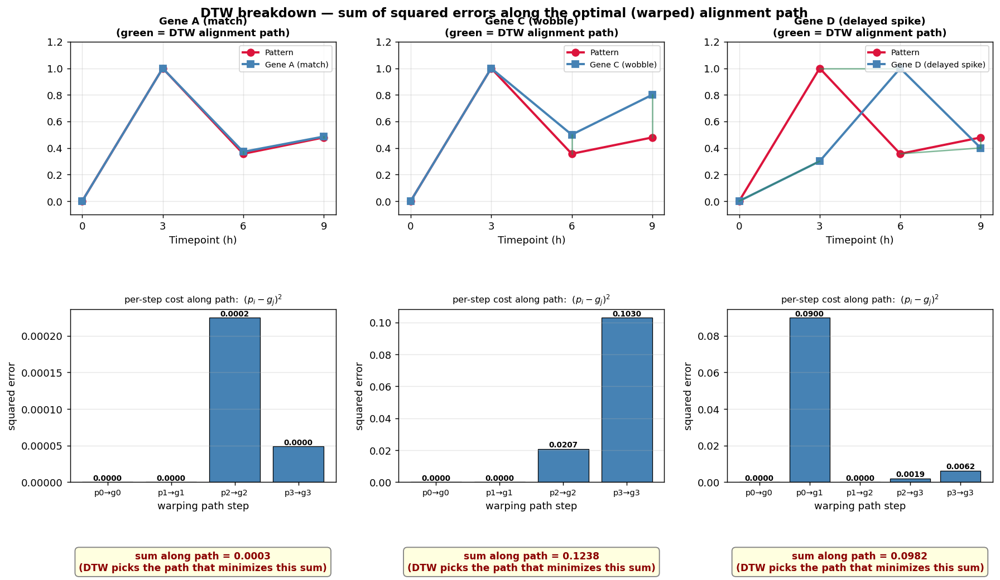

*Top row: green lines show each step of the optimal warping path —
"p_i → g_j" means pattern's i-th point gets matched to gene's j-th point.
Bottom row: the **squared error at each path step** $(p_i - g_j)^2$. These
sum to the DTW distance shown in the yellow box. For Gene A and Gene C the
optimal path is the diagonal (4 steps, no warping needed). For Gene D the
path has 5 steps because pattern's t=3 gets matched to *both* of gene's
neighbors (t=3 and t=6) to chase the delayed spike — that warp is exactly
what makes DTW different from MSE.*

### 4.4 Frechet Distance (Discrete)  *(lower is better)*

$$C[i,j] = \max\bigl(d(p_i, g_j),\, \min(C[i{-}1,j],\, C[i,j{-}1],\, C[i{-}1,j{-}1])\bigr)$$

- **Intuition**: the "dog-walking distance". Two walkers (one on each curve)
  connected by a leash, both moving forward only. Frechet = shortest leash
  length needed to traverse both curves.
- **Difference from DTW**: same DP recurrence but uses **max** instead of
  **sum**. DTW averages errors across the path; Frechet is dominated by the
  *worst single deviation*.
- **Behavioral consequence**: a gene that is slightly off everywhere → low DTW,
  moderate Frechet. A gene perfect at 3 points but terrible at 1 → low DTW,
  high Frechet. Frechet is the **most conservative** metric.
- **Why it clusters with MSE**: at n = 4 the largest single error term tends to
  dominate the squared sum anyway, so Frechet ≈ MSE on this data (19–20/20 overlap).

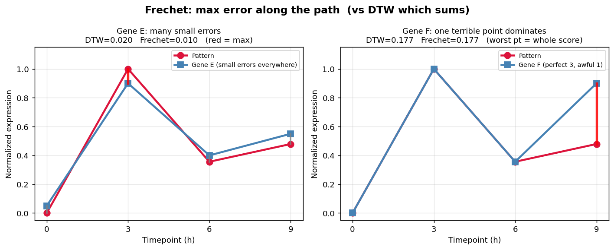

*Gray bars = pointwise errors, red bar = the maximum (= the Frechet distance).
Left: Gene E has small errors at every point — DTW sums them, Frechet only
sees the largest one (so it scores Gene E very well). Right: Gene F is
perfect at 3 of 4 points but disastrous at one — that single bad point
becomes Gene F's entire Frechet score. This is why Frechet is the most
"conservative" of the distance metrics.*

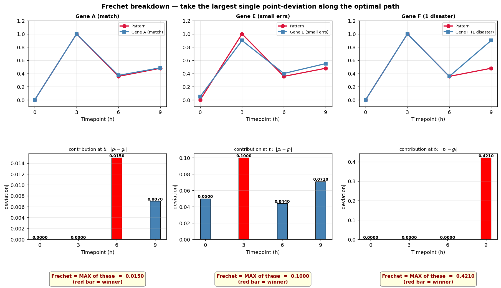

*Per-timepoint absolute deviations $|p_i - g_i|$. Frechet ignores 3 of these
4 numbers and just takes the **maximum** (highlighted red). Gene A's worst
point is 0.015 → Frechet = 0.015. Gene E's worst point is 0.10 → Frechet =
0.10 (the other three small errors don't matter). Gene F has three exact
matches and one 0.42 error → Frechet = 0.42, ignoring the perfection at
t=0,3,6. The same exact bars get summed/averaged for MSE — that's the only
difference between the two metrics on this data.*

### 4.5 MSE — Mean Squared Error  *(lower is better)*

$$\text{MSE} = \frac{1}{n}\sum_{i}(p_i - g_i)^2 = \frac{1}{n}\|\mathbf{p}-\mathbf{g}\|^2$$

- **Intuition**: the simplest metric — average squared point-to-point error.
  No alignment, no centering, no angles. Just Euclidean distance squared.
- **Relationship to Pearson** (if you get asked):
  $$\text{MSE} = \text{Var}(\mathbf{p}) + \text{Var}(\mathbf{g}) - 2r\,\sigma_p\sigma_g + (\bar{p} - \bar{g})^2$$
  When the variances and means are equal, this reduces to $\text{MSE} = 2\sigma^2(1-r)$,
  i.e. MSE is monotonic in $1 - r$. After (0,1] normalization, the variances
  and means are *similar* (not identical), so this is approximately true and
  explains the 16–18/20 Pearson–MSE overlap.
- **Independent perspective**: even though it overlaps with Pearson, MSE provides
  an independent distance-based confirmation — Pearson via angles, MSE via
  Euclidean distance. Agreement between the two is meaningful.
- **Why normalization matters here**: without it, MSE would just rank genes by
  expression magnitude.

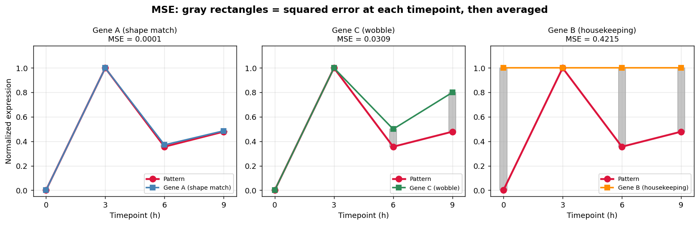

*Each gray rectangle is the pointwise error at one timepoint; MSE squares
those and averages. Gene A's rectangles are nearly invisible (MSE ≈ 0.0001),
Gene C is moderate (the wobble adds up to ≈ 0.04), and Gene B has 3 large
rectangles (MSE ≈ 0.42). Compare with the Pearson plot — the genes that
score well there also score well here, which is exactly the 16-18/20 overlap
you see in practice.*

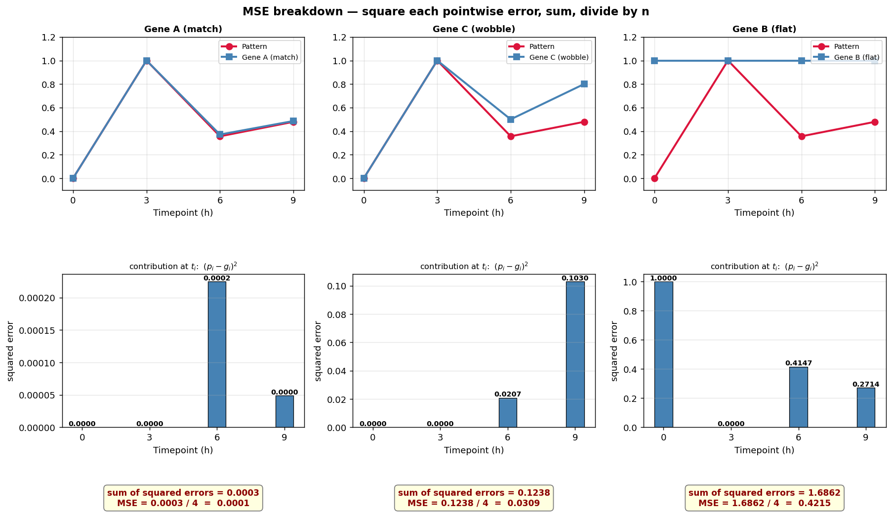

*Bars are $(p_i - g_i)^2$ at each timepoint. MSE simply **sums these and
divides by 4**. The yellow box shows that arithmetic explicitly. Notice the
y-axis scales — Gene A's tallest bar is 0.0002, Gene C's is 0.10, and Gene
B's is 1.0. This is exactly what makes MSE a "shape after normalization"
metric: a flat housekeeping gene gets penalized at every timepoint where the
pattern moves, so the squared errors stack up.*

### 4.6 sMAPE — Symmetric Mean Absolute Percentage Error  *(lower is better)*

$$\text{sMAPE} = \frac{1}{n}\sum_{i} \frac{2\,|p_i - g_i|}{|p_i| + |g_i|}$$

- Each term lies in $[0, 2]$. "Symmetric" form divides by the *average* of the
  two values, avoiding standard MAPE's asymmetry.
- **Intuition**: percentage error at each timepoint. A 0.01 error around 0.01
  counts the same as a 1.0 error around 1.0.
- **Catastrophic failure on clusterThree**: clusterThree's pattern has a zero
  at t=3. When $p_i = 0$, the sMAPE term collapses to $2|g_i| / |g_i| = 2.0$
  for *every gene* — the most informative timepoint provides zero discrimination.
  Result: **0/20 overlap with every other method** on clusterThree.
- **When sMAPE is appropriate**: forecast evaluation where all values are well
  away from zero. *Not* time-series shape matching when the reference touches
  zero.

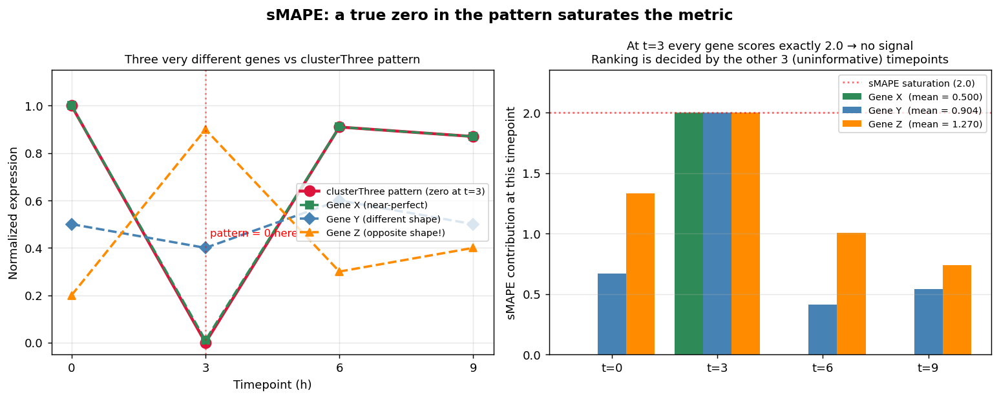

*Left: three very different genes vs the clusterThree pattern (which has a
zero at t=3). Gene X is nearly perfect, Gene Y is shaped differently, Gene Z
has the **opposite** shape (it peaks where the pattern dips). Right:
per-timepoint sMAPE contribution. Notice the t=3 bars — **all three genes hit
exactly 2.0** (the saturation maximum) regardless of their value, because
$2|0 - g_i|/(0 + |g_i|) = 2$. The most informative timepoint contributes
zero discriminating power, and the ranking gets decided by errors at the
three boring timepoints. That's the clusterThree failure in one chart.*

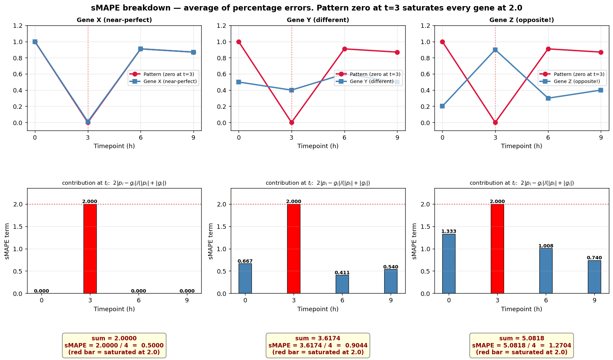

*The same data with the full per-gene calculation. The yellow box shows the
sum of the four bars and the divide-by-4 step. The red bar at t=3 is the
saturation value (2.0) — every gene gets it regardless of how close their
value is. Gene X's final sMAPE is **0.50** even though it's nearly identical
to the pattern, because the t=3 saturation alone contributes 2/4 = 0.5 to
the average. Gene Z (opposite shape, peaks where it should dip) gets
**1.27** — only 2.5× worse than the perfect gene. This is why sMAPE produces
nonsense rankings for clusterThree: the saturation floods out the actual
shape information.*

---

## 5. Method Clustering — Which Metrics Agree, and Why

This is the most likely "why" question. The answer:

| Group | Members | What they share |
|---|---|---|
| Shape/distance | Pearson, MSE, Frechet | All three converge on the same notion of "close trajectory" after normalization. MSE ≈ $2\sigma^2(1-r)$ relationship + Frechet dominated by the same large-error terms as MSE at n=4. |
| Alignment | DTW | Same as the shape group when warping doesn't matter (clusterThree: 17-19/20 overlap). Diverges when temporal shifts exist (clusterTwo: 2-3/20 overlap). |
| Magnitude-biased | Cosine | No mean-centering → baseline-bias term dominates. Pulls in housekeeping genes. Behavior depends on pattern geometry — sometimes overlaps with Pearson (clusterThree, near-flat pattern), sometimes doesn't (clusterOne, spike). |
| Percentage-based | sMAPE | Isolated when pattern touches zero (clusterThree: 0 overlap with all). Moderate overlap elsewhere but generally measures something different. |

**One-line version**: Pearson + MSE + Frechet are nearly redundant. DTW is
distinct only when timing matters. Cosine and sMAPE measure different things
that are mostly *not* what we want for biological shape matching.

---

## 6. Ensemble / Consensus Computation

This is the second most likely question — "how did you combine the methods?"
The key thing to clear up first: **mean rank and "avg rank" are the same
number** — `rank_df.mean(axis=1)`. The two ensemble *methods* use that single
number in different ways (one as a tiebreak, one as the primary sort key).

### Step 1: Convert scores to ranks
For each method × cluster, convert raw scores to ranks where **1 = best**.
The conversion respects each method's ordering convention (Pearson high-good,
MSE/DTW/Frechet/sMAPE low-good, Cosine high-good). After this step every gene
has 6 rank values, one per method, all on the same 1-to-N scale.

```python
rank_df[method] = scores.rank(ascending=ascending, method='min')
```

From those 6 ranks per gene, we compute exactly two derived numbers:

```python
votes     = (rank_df <= 20).sum(axis=1)   # how many methods put it in their top-20
mean_rank = rank_df.mean(axis=1)          # average rank across the 6 methods
```

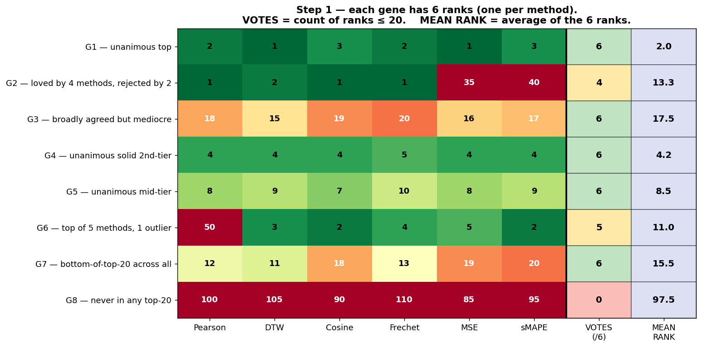

*Toy example with 8 engineered genes. The heatmap is the rank a gene received
from each method (1 = best, green; bad ranks in red and capped at 25 for color
purposes — the actual numbers are still printed in the cells). The two
right-hand columns are derived from those 6 ranks: VOTES counts how many of
them are ≤ 20, MEAN RANK is just the row average. These two numbers feed every
ensemble method.*

### Step 2: Two ways to sort by those numbers

**Method A — Vote count (mean rank as tiebreaker):**
```python
result.sort_values(['votes', 'mean_rank'], ascending=[False, True])
```
Sort primarily by votes (descending). Mean rank only matters when two genes
have the same vote count.

**Method B — Mean rank only:**
```python
result.sort_values('mean_rank', ascending=True)
```
Ignore votes entirely. This is **Borda count** in disguise — a rank-based
consensus that doesn't care about the top-20 cutoff at all.

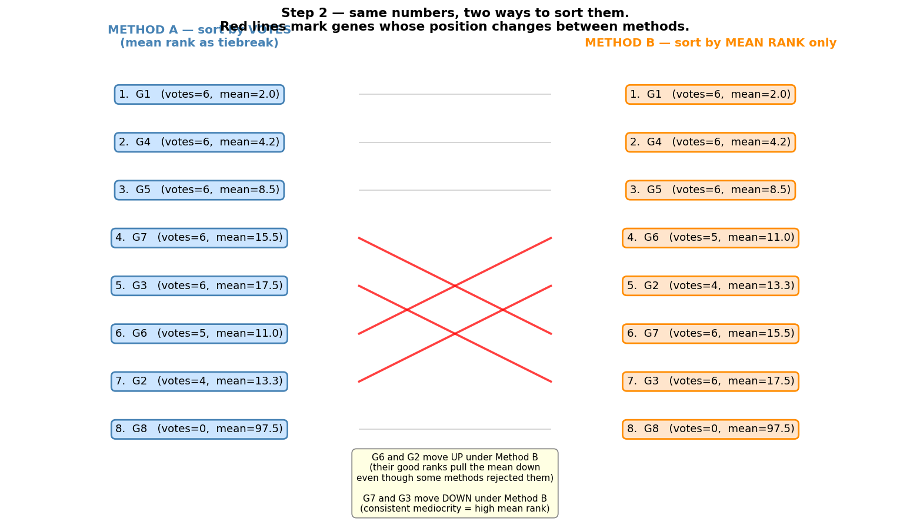

*Same 8 genes, sorted two ways. Genes connected by gray lines stay in the same
position; red lines mark genes that move. **G6** has rank 50 in Pearson (one
method rejected it) so its votes are only 5 — Method A pushes it down to
position 6. But its other 5 ranks are all single-digit, so its mean is 11.0,
better than several 6/6-vote genes — Method B pulls it up to position 4.
Conversely, **G7** is broadly agreed on (6/6 votes) but its individual ranks
are all 11–20, so Method B drops it from position 4 to position 6 in favor of
genes that ranked higher despite being rejected by 1 method.*

### Step 3: Visualization with consensus opacity
The actual plotting code draws each top-N gene with **opacity proportional to
vote count**:

```python
alpha = 0.2 + 0.6 * (votes / max_votes)
```

Genes that all 6 methods agree on are dark; 1-2 vote outliers are faded. This
is the third use of the same data — votes drive opacity, mean rank drives the
selection of which genes to plot.

### Why both methods matter
- **Vote count** is coarse but robust — it only cares about top-20 membership.
  Resistant to one method's extreme ranking pulling things around.
- **Mean rank** uses the full ranking info — finer resolution, but a single
  outlier can move a gene a lot. (Median rank is the robust version, also
  computed in the notebook.)
- **Together** they let you ask: "is this gene a unanimous top pick
  (high votes, low mean), or is it driven by a few methods that loved it
  while others rejected it (low votes, low mean)?" The actual SUMMARY_REPORT
  tables show both columns side-by-side because the row order is set by mean
  rank but the votes column tells you breadth.

### Recommended ensemble subset
Because Frechet and MSE are 19–20/20 redundant, the SUMMARY_REPORT recommends
a **4-method ensemble** (Pearson + DTW + Frechet + MSE) with a **≥3/4 vote**
threshold. Drop sMAPE (zero failure on clusterThree) and Cosine (housekeeping
gene bias). Some places suggest a **3-method ensemble** (Pearson + DTW + MSE)
with ≥2/3 — more honest about effective degrees of freedom since Frechet ≈ MSE.

---

## 7. Per-Cluster Results — What to Expect

### clusterOne — spike at t=3, partial recovery
- Pearson, DTW, Frechet, MSE strongly agree (16-18/20 overlap).
- Cosine pulls in housekeeping genes (2/20 overlap with Pearson).
- sMAPE moderate (8-9/20).
- Top consensus genes (5/6 votes): SSR3, REXO2, YIF1A, MAZ, ACBD3, GSPT2.

### clusterTwo — steady increase
- DTW diverges (3/20 with Pearson) because warping flexibility actually
  manifests with monotonic data — finds delayed-increase genes others miss.
- Pearson + Frechet + MSE still tight (15-17/20).
- **Unanimous winners (6/6 votes)**: FAM49B, RNF213.
- **clusterTwoLT is the best result overall**: 9 genes get 6/6 votes
  (RAB14, SYNGR1, ARHGAP25, HNRNPH3, BSG, CAPN2, NOL7, ZC3H15, PRDX6).

### clusterThree — dip at t=3
- All methods *except sMAPE* agree very strongly (17-20/20 overlap).
- **sMAPE has 0/20 overlap with everything else** because of the zero at t=3
  failure. sMAPE genes look great by mean rank but should be **excluded** —
  they're noise.
- Real consensus: TEDC1, PGAP1, TANGO6, CTBP1-AS.

### clusterFour — 70× spike (the problem cluster)
- After normalization the pattern is effectively $[0, 1, 0, 0]$ — a delta function.
- **Surprising structure**: Cosine, Frechet, MSE form a tight cluster (19-20/20)
  — but for the *wrong reason*. They're all dominated by the t=3 magnitude, so
  they collapse into a "rank by expression at t=3" ranking.
- Pearson, DTW, sMAPE are all isolated (0/20 overlap with each other).
- **No real consensus emerges**. Top ensemble genes have avg rank ≈ 1362 with
  only 1 vote each.
- **Resolution requires denser time sampling** (e.g., t = 0, 1, 2, 3, 4, 5, 6, 9)
  or a peak-detection approach instead of whole-series matching.

---

## 8. Recommendations (Use These if Asked "What Should We Do Going Forward")

1. **Primary metric: Pearson correlation** — most interpretable, scale + shift
   invariant, directly captures the biological question.
2. **Secondary validation: MSE or Frechet** — independent distance-based
   confirmation. Pearson + MSE agreement = high confidence.
3. **Skip for this dataset**: Cosine (magnitude bias finds housekeeping genes)
   and sMAPE (breaks at zero values).
4. **DTW**: marginal value at 4 timepoints; would matter much more with denser
   sampling. Worth keeping in the ensemble for the clusterTwo case where it
   genuinely diverges.
5. **Ensemble strategy**: 4-method (Pearson + DTW + Frechet + MSE) with ≥3/4 vote
   threshold, OR 3-method (Pearson + DTW + MSE) with ≥2/3.
6. **clusterFour**: needs more timepoints or peak-detection, not a similarity-metric
   problem.
